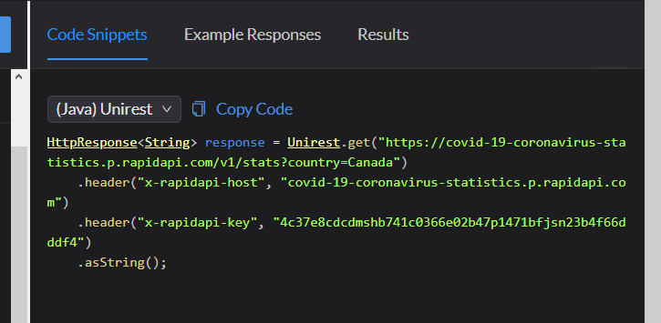
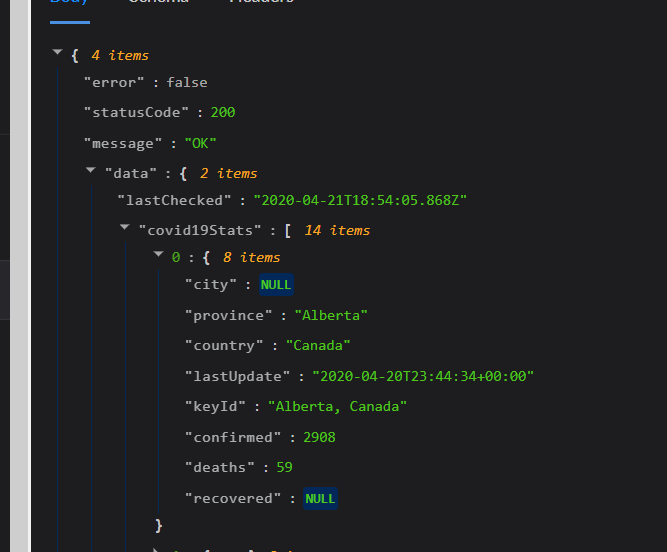
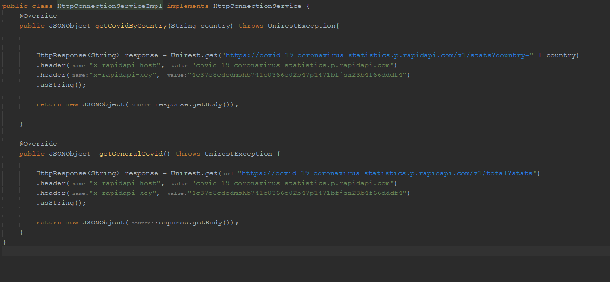

# Escuela Colombiana de Ingeniería Julio Garavito - Arquitecturas de Software ARSW - Parcial Segundo Tercio

## Juan Sebastian garcia hincapie

## Descripción del Problema a Solucionar

Usted está muy preocupado por la situación sanitaria que atraviesa el mundo debido al virus COVID-19 popularmente llamado Coronavirus. Es por eso que usted decidió hacer una aplicación web informativa donde se pueda leer fácilmente información estádistica al respecto.

La aplicación mostrará inicialmente una estádistica general en la cuál se pueden listar todos los paises que presentán casos de infección confirmados, muertes y finalmente personas curadas. Esta lista deberá aparecer ordenada por los siguientes criterios:

 - Número de muertes.
 - Número de infectados.
 - Número de curados.

Adicionalmente cuando el usuario de la aplicación haga click sobre el nombre de un país determinado, usted debe mostrar la misma información (casos de infección confirmados, muertes y personas curadas) solo que en esta ocasión debe hacerlo no de manera consolidada sino que debe expandir la información por provincia. (Pruebe con China, Canada o US, países con múltiples provisncias infectadas).

Para obtener dicha información utilice el API gratuito de [COVID-19 Coronavirus Statistics](https://rapidapi.com/KishCom/api/covid-19-coronavirus-statistics) el cual usted debió estudiar previamente antes de este examen.

Se le pide que su implementación sea eficiente en cuanto a recursos así que debe implementar un caché que permita evitar hacer consultas repetidas al API externo cuando consulte las estadisticas para un país especifico.

Una vez tenga la funcionalidad básica, extienda su implementación para incluir un mapa en el cual resalte con un indicador la ubicación del país seleccionado por el usuario (revise la funcionalidad del API de mapas y el ejemplo anexo.).

Como el API del coronavirus no brinda información sobre la latitud y longitud del país consultado, apoyese en este [API](https://rapidapi.com/apilayernet/api/rest-countries-v1?endpoint=53aa5a09e4b051a76d24136a). AJUSTE LOS DIAGRAMAS DE ARQUITECTURA QUE SEAN NECESARIOS PARA REFLEJAR EL USO DE ESTE COMPONENTE.

Sugerencia realice la implementación de manera incremental. Haga commits regulares.

## Implementacion
Se hace uso de la api presente en https://rapidapi.com en el link anteriomente mecionado, obteniendo nuestra key: 

a partir de esto se obtiene el JSON correpondiente

ademas de esto se brindan las 2 opciones 

### Diagrama de Despliegue

### Diagrama de Componentes

